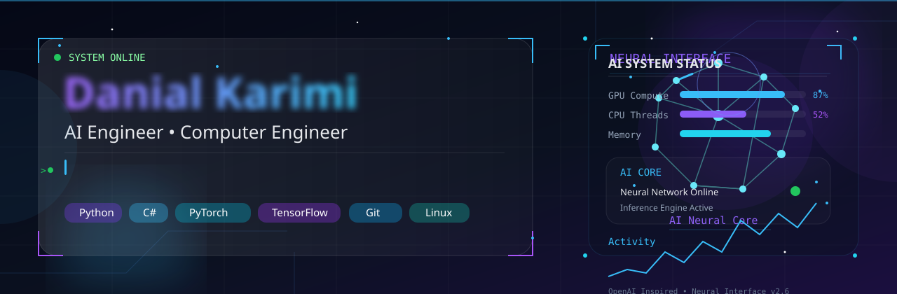

<p align="center">
  
</p>

```python
class DanialKarimi:
    def __init__(self):
        self.name = "Danial Karimi"
        self.role = "AI Engineer | Computer Engineer"
        self.focus = [
            "Artificial Intelligence",
            "Machine Learning",
            "Deep Learning"
        ]
        self.current_goal = "Building Intelligent Systems"
        self.future = "Founder"

    def motto(self):
        return "Code. Learn. Build. Repeat."
```

<p align="left">
  
</p>

## 👨‍💻 About Me

I'm Danial Karimi, an aspiring **AI Engineer** and **Computer Engineering** student with a passion for building intelligent software and solving real-world problems through technology.

I'm currently expanding my expertise in **Artificial Intelligence**, **Machine Learning**, **Deep Learning**, and **Software Engineering** while building projects with **Python** and modern AI frameworks.

Beyond engineering, I aspire to become a **Founder**, creating technology that delivers meaningful impact through innovation and continuous learning.

> *"Building Intelligent Systems, One Project at a Time."* 🚀
